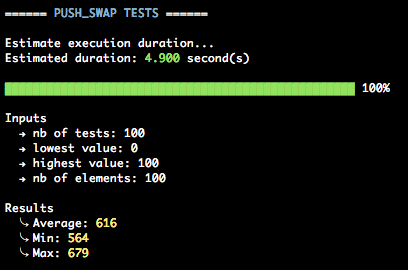
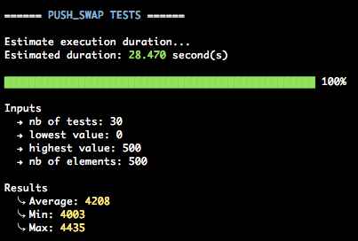
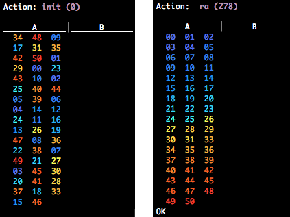

# Push swap

The __*push_swap*__ project at [42](https://www.42.fr/) consists in writing a program able to sort a stack with a limited number of instructions using the lowest possible number of operations.

It serves as an introduction to sorting algorithms and the notion of complexity.

## Instructions

You have to write 2 programs:
- **_./checker_**: takes integers as arguments and reads instructions on the standard input. Once read, the program executes them and displays `OK` if the integers are sorted, otherwise displays `KO`.
- **_./push_swap_**: takes integers as arguments and displays a list of actions separated by newlines on the standard output, which applied successively should sort the list of integers received as arguments.

Example:
```
$ ./push_swap 5 3 4 1 2 | tee sorting_instructions.txt
pb
pb
ra
pa
pa
sa
ra
ra
$ ./checker 5 3 4 1 2 < sorting_instructions.txt
OK
```

### Rules

The game is composed of 2 stacks: `A` and `B`.

At the beginning:
- `A` contains a random number of either positive or negative numbers without duplicates
- `B` is empty

The goal is to sort the integers in stack `A` in ascending order, but only with the following set of operations:

| Operation | Action                                                           |
|:---------:|:-----------------------------------------------------------------|
| pa        | **Push** the element at the top of stack b to the top of stack a | 
| pb        | **Push** the element at the top of stack a to the top of stack b |
| ra        | **Rotate** stack a, the first element becomes the last           |
| rb        | **Rotate** stack b, the first element becomes the last           |
| rr        | **Rotate** both stacks                                           |
| rra       | **Reverse rotate** stack a, the last element becomes first       | 
| rrb       | **Reverse rotate** stack b, the last element becomes first       |
| rrr       | **Reverse rotate** both stacks                                   |
| sa        | **Swap** the first and second elements in stack a                |
| sb        | **Swap** the first and second elements in stack b                |
| ss        | **Swap** the first and second elements in both stacks            |

Only the following functions from the libc are allowed: `write`, `read`, `malloc` and `free`.

## Results

The performance of the push_swap program is evaluated according to the following grading system.

I wrote a script to automatically assess the performance of my program (see [here](https://github.com/jkgithubrep/42_push_swap_checker) for more information).

#### Stack with 100 numbers
| Number of instructions       | Grade  |
| :--------------------------: |:------:|
| < 700                        | 5/5    |
| < 900                        | 4/5    |
| < 1100                       | 3/5    |
| < 1300                       | 2/5    |
| < 1500                       | 1/5    |

**=> My results**:



#### Stack with 500 numbers
| Number of instructions       | Grade  |
| :--------------------------: |:------:|
| < 5500                       | 5/5    |
| < 7000                       | 4/5    |
| < 8500                       | 3/5    |
| < 10000                      | 2/5    |
| < 11500                      | 1/5    |

**=> My results**:



## Additional features

Here are some non-mandatory features I included to the project:
- A **detailed error handling system** (`-e` option):
```
$ ./checker -e
Error: wrong number of arguments
$ ./checker -e 1 2 a 3
Error: invalid argument
$ ./checker -e 1 2 3 1
Error: duplicated values
$ ./checker -e 3 2 9999999999 5
Error: overflow
$ ./checker -e -z 2 3 5 4
Error: invalid flag
```
- A dynamic and colorized visualizer with a speed option (`-v` with the speed option `-s` for slow and `-f` for fast) that displays the number of instructions:



## Key learnings

- **Sorting algorithms** (implemented a mix between a *quick sort* and an *insertion sort* for the push_swap program, and a *merge sort* to check for duplicated entry values)
- **Sorting terminology**: in-place sorting, stability
- **Time complexity**: best/worse/average-case
